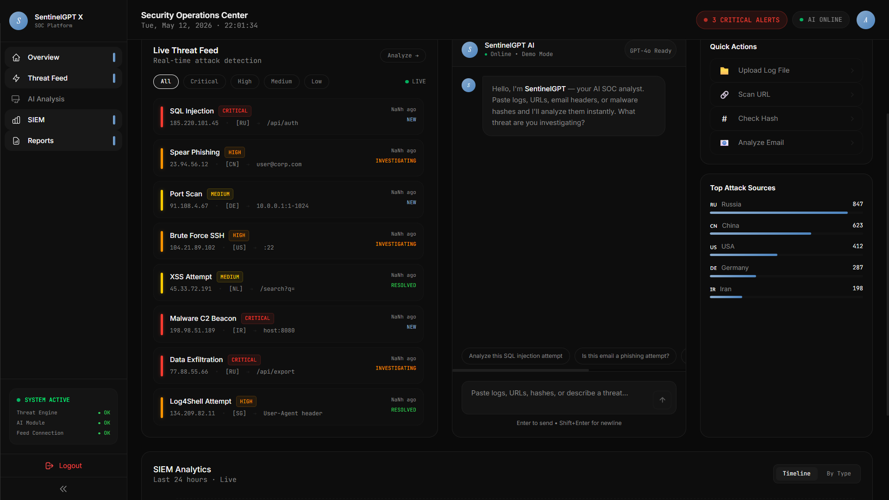

# SentinelGPT-XDR

AI-powered SOC & XDR platform for real-time cybersecurity monitoring, SIEM visualization, threat intelligence, and incident response.

---

# Dashboard

.png)

---

# AI Threat Analyzer


---

# GPT Security Assistant



---

# Features

- Real-time Threat Monitoring
- AI-assisted Threat Analysis
- SIEM Dashboard
- Interactive Cybersecurity UI
- Threat Intelligence Feed
- Authentication System
- MERN Stack Architecture
- Security Event Visualization

---

# Tech Stack

## Frontend
- React.js
- TypeScript
- Tailwind CSS
- Vite

## Backend
- Node.js
- Express.js
- MongoDB

## Security & AI
- JWT Authentication
- AI-assisted Threat Analysis
- SOC Monitoring Concepts
- XDR Visualization

---

# System Modules

## Dashboard
Displays real-time cybersecurity alerts, AI-generated monitoring insights, and system status.

## Threat Feed
Monitors cyber threats such as:
- SQL Injection
- Port Scanning
- Log4Shell Attempts
- Suspicious Activities

## AI Analysis
AI-assisted analysis engine for identifying suspicious behavior and cybersecurity patterns.

## Reports
Displays security monitoring logs and cybersecurity event reports.

---

# Installation

## Clone Repository

```bash
git clone https://github.com/harinipoobalan017/SentinelGPT-X---AI-SOC-Analyst.git
Backend Setup
cd backend
npm install
npm run dev
Frontend Setup
cd frontend
npm install
npm run dev
Environment Variables

Create a .env file inside backend folder and configure:

MONGODB_URI=
JWT_SECRET=
OPENAI_API_KEY=
Future Enhancements
Real-time Socket Integration
AI Threat Prediction
Threat Intelligence APIs
Cloud Deployment
Live Security Analytics
Malware Detection Modules
Advanced AI-based Monitoring
Author

Harini P

Full-Stack Developer | Cybersecurity, IoT & AI Enthusiast
